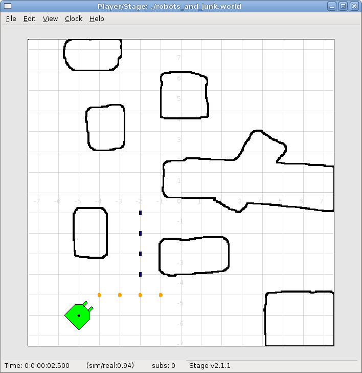

# Chapter 3 - <a name="sec_BuildingAWorld"> Building a World</a>

First we will run a world and configuration file that comes bundled with
Stage. In your bash shell navigate to the Stage/worlds folder, by default
(in Linux at least) this is /usr/local/share/stage/worlds. Once in the
correct folder type the following command to run the "simple world" that comes with Player/Stage:

`player simple.cfg`

Assuming Player/Stage is installed properly you should now have a window
open which looks like Figure 1.

<!--- Figure --->
| |
| :---------------:| 
|      |
| Figure 1: The `simple.cfg` world after being run | 

Congratulations, you can now build Player/Stage simulations! 

## 3.1 - <a name="sec_BuildingAWorld_EmptyWorld"> Building an Empty World </a>

As you can see above, when we tell Player to build a world we only give it
the .cfg file as an input. This .cfg file needs to tell us where to find
our .world file, which is where all the items in the simulation are
described. To explain how to build a Stage world containing nothing but
walls we will use an example.

To start building an empty world we need a .cfg file. First create a
document called `empty.cfg` (i.e. open in your favorite text editor -
`gedit` is a good starter program if you don't have a favorite) and copy
the following code into it: 
```
driver
(		
   name "stage"
   plugin "stageplugin"

   provides ["simulation:0" ]

   # load the named file into the simulator
   worldfile "empty.world"	
)
```

The configuration file syntax is described in [Chapter 4](CFGFILES.md), 
but basically what is happening here is that
your configuration file is telling Player that there is a driver called
`stage` in the `stageplugin` library, and this will give Player
data which conforms to the `simulation` interface. To build the
simulation Player needs to look in the worldfile called `empty.world`
which is stored in the same folder as this .cfg. If it was stored elsewhere
you would have to include a filepath, for example
`./worlds/empty.world`. Lines that begin with the hash symbol (\#) are
comments.  When you build a simulation, any simulation, in Stage the above
chunk of code should always be the first thing the configuration file says.
Obviously the name of the worldfile should be changed depending on what you
called it though.

Now a basic configuration file has been written, it is time to tell
Player/Stage what to put into this simulation. This is done in the .world
file. 

### 3.1.1 - <a name="sec_BuildingAWorld_EmptyWorld_Models"> Models </a>

A worldfile is basically just a list of models that describes all the stuff
in the simulation. This includes the basic environment, robots and other
objects. The basic type of model is called "model", and you define a model using the following syntax:
```
define model_name model
(
   # parameters
)
```
This tells Player/Stage that you are `defining` a `model` which you have called `model_name`, and all the stuff in the round brackets are parameters of the model. To begin to understand Player/Stage model parameters, let's look at the `map.inc` file that comes with Stage, this contains the `floorplan` model, which is used to describe the basic environment of the simulation (i.e. walls the robots can bump into):
```
define floorplan model
(
  # sombre, sensible, artistic
  color "gray30"

  # most maps will need a bounding box
  boundary 1

  gui_nose 0
  gui_grid 0
  gui_move 0
  gui_outline 0
  gripper_return 0
  fiducial_return 0
  ranger_return 1
)
```
We can see from the first line that they are defining a `model` called `floorplan`. 

* `color`: Tells Player/Stage what colour to render this model, in this
  case it is going to be a shade of grey. 
* `boundary`: Whether or not there is a bounding box around the model. This
  is an example of a binary parameter, which means the if the number next
  to it is 0 then it is false, if it is 1 or over then it's true. So here
  we DO have a bounding box around our "map" model so the robot can't
  wander out of our map.  
* `gui_nose`: this tells Player/Stage that it
  should indicate which way the model is facing. Figure 2
  shows the difference
  between a map with a nose and one without.  `gui_grid`: this will
  superimpose a grid over the model. Figure 3 shows a map with a grid.
* `gui_move`: this indicates whether it should be possible to drag and drop
  the model. Here it is 0, so you cannot move the map model once
  Player/Stage has been run. In 
  [Building a World](#sec_BuildingAWorld) when the
  Player/Stage example `simple.cfg` was run it was possible to drag and
  drop the robot because its `gui_move` variable was set to 1.
* `gui_outline`: indicates whether or not the model should be outlined.
  This makes no difference to a map, but it can be useful when making
  models of items within the world.
* `fiducial_return`: any parameter of the form
  some_sensor_return describes how that kind of sensor should react to the
  model. "Fiducial" is a kind of robot sensor which will be described later
  in [Robot Sensors](#sec_BuildingAWorld_BuildingRobot_RobotSensors). Setting
  `fiducial_return` to 0 means that the map cannot be detected by a
  fiducial sensor.
* `ranger_return`: Setting `ranger_return` to a negative
      number indicates that a model cannot be seen by ranger sensors.
      Setting `ranger_return` to a number between 0 and 1 (inclusive)
      (Note: this means that `ranger_return 0` **will allow** a ranger
      sensor to see the object --- the *range* will get set, it'll just set
      the *intensity* of that return to zero.)  See [Interaction with
      Proxies --- Ranger](CONTROLLERS.md#sec_Coding_InteractingWithProxies_ranger) for more details.
      controls the intensity of the return seen by a ranger sensor.
* `gripper_return`: Like `fiducial_return`, `gripper_return` tells
  Player/Stage that your model can be detected by the relevant sensor, i.e.
  it can be gripped by a gripper. Here `gripper_return` is set to 0 so the
  map cannot be gripped by a gripper. 


<!--- Figure --->
| | |
| :---------------:| :------: |
|  |  |

Figure 2: The first picture shows an empty map without a nose. The second
picture shows the same map with a nose to indicate orientation,
this is the horizontal line from the centre of the map to the
right, it shows that the map is actually facing to the right.
		
<!--- Figure --->
| |
| :---------------:| 
|  |
| Figure 3: An empty map with gui_grid enabled. With gui_grid disabled this would just be an empty white square. |
	
To make use of the `map.inc` file we put the following code into our world file:
```
include "map.inc"
```
This inserts the `map.inc` file into our world file where the include line is. This assumes that your worldfile and `map.inc` file are in the same folder, if they are not then you'll need to include the filepath in the quotes. Once this is done we can modify our definition of the map model to be used in the simulation. For example:
```
floorplan
(
   bitmap "bitmaps/helloworld.png"
   size [12 5 1]	
)
```

What this means is that we are using the model "floorplan", and making some
extra definitions; both "bitmap" and "size" are parameters of a
Player/Stage model. Here we are telling Player/Stage that we defined a
bunch of parameters for a type of model called "floorplan" (contained in
map.inc) and now we're using this "floorplan" model definition and adding a
few extra parameters.

* `bitmap`: this is the filepath to a bitmap, which can be type bmp, jpeg,
  gif or png. Black areas in the bitmap tell the model what shape to be,
  non-black areas are not rendered, this is illustrated in Figure 4. In the
  map.inc file
  we told the map that its "color" would be grey. This parameter does not
  affect how the bitmaps are read, Player/Stage will always look for black
  in the bitmap, the `color` parameter just alters what colour the map is
  rendered in the simulation.  
* `size`: This is the size *in metres* of the
  simulation. All sizes you give in the world file are in metres, and they
  represent the actual size of things. If you have 3m x 4m robot testing
  arena that is 2m high and you want to simulate it then the `size` is \[3 4
  2\]. The first number is the size in the *x* dimension, the second is the
  *y* dimension and the third is the *z* dimension.

<!--- Figure --->
| | |
| :---------------:| :------: |
|  |  |

Figure 4: The first image is our "helloworld.png" bitmap, the second image is
what Player/Stage interprets that bitmap as. The coloured areas are walls,
the robot can move everywhere else.
		
A full list of model parameters and their descriptions can be found in the
[official Stage manual](http://rtv.github.com/Stage/group__model.html)
Most of the useful parameters have already been described here, however
there are a few other types of model which are relevant to building
simulations of robots, these will be described later in 
[Building a Robot](#sec_BuildingAWorld_BuildingRobot).

### 3.1.2 - <a name="sec_BuildingAWorld_EmptyWorld_PLSTWindow"> Describing the Player/Stage Window </a>

The worldfile also can be used to describe the simulation window that
Player/Stage creates. Player/Stage will automatically make a window for the
simulation if you don't put any window details in the worldfile, however,
it is often useful to put this information in anyway. This prevents a large
simulation from being too big for the window, or to increase or decrease
the size of the simulation.

Like a model, a window is an inbuilt, high-level entity with lots of
parameters. Unlike models though, there can be only one window in a
simulation and only a few of its parameters are really needed. The
simulation window is described with the following syntax: 
```
window
(
   # parameters...
)
```

The two most important parameters for the window are `size` and `scale`.

* `size`: This is the size the simulation window will be *in pixels*. You
  need to define both the width and height of the window using the
  following syntax: `size [width height]`.  
* `scale`: This is how many
  metres of the simulated environment each pixel shows. The bigger this
  number is, the smaller the simulation becomes. The optimum value for the
  scale is window_size/floorplan_size and it should be rounded
  downwards so the simulation is a little smaller than the window it's in,
  some degree of trial and error is needed to get this right. 

A full list of window parameters can be found in [the Stage manual under
"WorldGUI"](http://rtv.github.com/Stage/group__worldgui.html)

### 3.1.3 - <a name="sec_BuildingAWorld_EmptyWorld_BasicWorldfile"> Making a Basic Worldfile </a>

We have already discussed the basics of worldfile building: models and the
window. There are just a few more parameters to describe which don't belong
in either a model or a window description, these are optional though, and
the defaults are pretty sensible.

* `interval_sim`: This is how many simulated milliseconds there are between each update of the simulation window, the default is 100 milliseconds.
* `interval_real`: This is how many real milliseconds there are between each update of the simulation window. Balancing this parameter and the `interval_sim` parameter controls the speed of the simulation. Again, the default value is 100 milliseconds, both these interval parameter defaults are fairly sensible, so it's not always necessary to redefine them.

The Stage manual contains [a list of the high-level worldfile
parameters](http://rtv.github.com/Stage/group__world.html)

Finally, we are able to write a worldfile!
```
include "map.inc"

# configure the GUI window
window
( 
   size [700.000 700.000] 
   scale 41
)

# load an environment bitmap
floorplan
(
   bitmap "bitmaps/cave.png" 
   size [15 15 0.5]
)
```

If we save the above code as empty.world (correcting any filepaths if
necessary) we can run its corresponding empty.cfg file (see 
[Empty World](#sec_BuildingAWorld_EmptyWorld)) to get the simulation shown
in Figure 5.

<!--- Figure --->
| |
| :---------------:| 
|      |
| Figure 5: Our Empty World | 
	
## 3.2 - <a name="sec_BuildingAWorld_BuildingRobot"> Building a Robot </a>

In Player/Stage a robot is just a slightly advanced kind of model, all the
parameters described in [Models](#sec_BuildingAWorld_EmptyWorld_Models) can
still be applied. 

### 3.2.1 - <a name="sec_BuildingAWorld_BuildingRobot_RobotSensors">Sensors and Devices</a>

There are six built-in kinds of model that help with building a robot, they
are used to define the sensors and actuators that the robot has. These are
associated with a set of model parameters which define by which sensors the
model can be detected (these are the `_return`s mentioned earlier). Each of
these built in models acts as an *interface* (see Section
[sec_Basics_InterfaceDriverDevices]) between the simulation and Player. If
your robot has one of these kinds of sensor on it, then you need to use the
relevant model to describe the sensor, otherwise Stage and Player won't be
able to pass the data between each other. It is possible to write your own
interfaces, but the stuff already included in Player/Stage should be
sufficient for most people's needs. A full list of interfaces that Player
supports can be found in the [Player
manual](http://playerstage.sourceforge.net/doc/Player-3.0.2/player/group__interfaces.html) although only the following are supported by the current distribution of Stage (version 4.1.X). Unless otherwise stated, these models use the Player interface that shares its name:

####camera
The [camera model](http://rtv.github.com/Stage/group__model__camera.html)
adds a camera to the robot model and allows your code to interact with the simulated camera. The camera parameters are as follows:

* `resolution [x y]`: the resolution, in pixels, of the camera's image.
* `range [min max]`: the minimum and maximum range that the camera can detect
* `fov [x y]`: the field of view of the camera *in DEGREES*.
* `pantilt [pan tilt]`: angle, in degrees, where the camera is looking. Pan is the left-right positioning. So for instance pantilt [20 10] points the camera 20 degrees left and 10 degrees down.

####blobfinder
[The blobfinder](http://rtv.github.com/Stage/group__model__blobfinder.html)
simulates colour detection software that can be run on the image from the
robot's camera. It is not necessary to include a model of the camera in
your description of the robot if you want to use a blobfinder, the
blobfinder will work on its own. 

In previous versions of Stage, there was a ` blob_return`
parameter to determine if a blobfinder could detect an object.  In Stage
4.1.1, this does not seem to be the case.  However, you can simply set an
object to be a color not listed in the ` colors[]` list to make it invisible
to blobfinders.

The parameters for the blobfinder are described in the Stage manual, but
the most useful ones are here:

* `colors_count <int>`: the number of different colours the
      blobfinder can detect
* `colors [ ]`: the names of the colours it can detect. This
      is given to the blobfinder definition in the form
      `["black" "blue" "cyan"]`. These colour names are from the
      built in X11 colour database rgb.txt. This is built in to
      Linux -- the file `rgb.txt` can normally be found at
      /usr/share/X11/rgb.txt assuming it's properly installed,
      or see [Wikipedia](http://en.wikipedia.org/wiki/X11_color_names) for
      details.
* `image [x y]`: the size of the image from the camera, in pixels.
* `range <float>`: The maximum range that the camera can detect, in metres.
* `fov <float>`: field of view of the blobfinder 
      *in DEGREES*.  Unlike the camera ` fov`, the
      blobfinder ` fov` respects the ` unit_angle` call as
      described in
      (http://playerstage.sourceforge.net/wiki/Writing_configuration_files#Units).  By default, the blobfinder `fov` is in DEGREES.

####fiducial 
A fiducial is a fixed point in an image, so the [fiducial
finder](http://rtv.github.com/Stage/group__model__fiducial.html) 
simulates image processing software that locates fixed points in an image. The fiducialfinder is able to locate objects in the simulation whose `fiducial_return` parameter is set to true. Stage also allows you to specify different types of fiducial using the `fiducial_key` parameter of a model. This means that you can make the robots able to tell the difference between different fiducials by what key they transmit. The fiducial finder and the concept of `fiducial_key`s is properly explained in the Stage manual. The fiducial sensors parameters are:

* `range_min`: The minimum range at which a fiducial can be detected, in metres.
* `range_max`: The maximum range at which a fiducial can be detected, in metres.
* `range_max_id`: The maximum range at which a fiducial's key can be
accurately identified. If a fiducial is closer that `range_max` but further
away than `range_max_id` then it detects that there is a fiducial but can't identify it.
* `fov`: The field of view of the fiducial finder *in DEGREES*.


#### <a name="sec_BuildingAWorld_BuildingRobot_RobotSensors_Ranger Sensor"> ranger sensor </a>
The [ranger sensor](http://rtv.github.com/Stage/group__model__ranger.html)
simulates any kind of obstacle detection device (e.g. sonars, lasers, or
infrared sensors). These can locate models whose ` ranger_return` is
non-negative. Using a ranger model you can define any number of ranger
sensors and apply them all to a single device. The parameters for the
` sensor` model and their inputs are described in the Stage manual, but
basically:

* `size [x y]`: how big the sensors are.
* `range [min max]`: defines the minimum and maxium distances that
can be sensed.
* `fov deg`: defines the field of view of the sensors in DEGREES
* `samples`: this is only defined for a laser - it specifies
      ranger readings the sensor takes. The laser model behaves like a
      large number of rangers sensors all with the same x and y coordinates
      relative to the robot's centre, each of these rangers has a slightly
      different yaw. The rangers are spaced so that there are samples
      number of rangers distributed evenly to give the laser's field of
      view. So if the field of view is 180 and there are 180 samples the
      rangers are 1 apart.

####ranger device
A [ranger device](http://rtv.github.com/Stage/group__model__ranger.html) is
comprised of ranger sensors.  A laser is a special case of ranger sensor
which allows only one sensor, and has a very large field of view.  For a
ranger device, you just provide a list of sensors which comprise this
device, typically resetting the pose for each.  How to write the `[x y
yaw]` data is explained in [Robot Sensors](#sec_BuildingAWorld_BuildingRobot_RobotSensors).
```
  sensor_name (pose [x1 y1 z1 yaw1])
  sensor_name (pose [x2 y2 z2 yaw2])
```

####gripper 
The [gripper model](http://rtv.github.com/Stage/group__model__gripper.html)
is a simulation of the gripper you get on a Pioneer robot.  The Pioneer
grippers looks like a big block on the front of the robot with two big
sliders that close around an object.  If you put a gripper on your robot
model it means that your robot is able to pick up objects and move them
around within the simulation. The [online Stage manual](??) says that grippers
are deprecated in Stage 3.X.X, however this is not actually the case and
grippers are very useful if you want your robot to be able to manipulate
and move items. The parameters you can use to customise the gripper model
are:

* `size [x y z]`: The x and y dimensions of the gripper.
* `pose [x y z yaw]`: Where the gripper is placed on the robot, relative to
  the robot's geometric centre. The pose parameter is decribed properly in
  [Robot Sensors](#sec_BuildingAWorld_BuildingRobot_RobotSensors).


####position 
The [position model](http://rtv.github.com/Stage/group__model__position.html)
simulates the robot's odometry, this is when the robot keeps track of where
it is by recording how many times its wheels spin and the angle it turns.
This robot model is the most important of all because it allows the robot
model to be embodied in the world, meaning it can collide with anything
which has its `obstacle_return` parameter set to true. The position model
uses the `position2d` interface, which is essential for Player because it
tells Player where the robot actually is in the world.  The most useful
parameters of the position model are:

* `drive`: Tells the odometry how the robot is driven. This is usually
  "diff" which means the robot is controlled by changing the speeds of the
  left and right wheels independently. Other possible values are "car"
  which means the robot uses a velocity and a steering angle, or "omni"
  which means it can control how it moves along the *x* and *y* axes of the
  simulation.  `localization`: tells the model how it should record the
  odometry "odom" if the robot calculates it as it moves along or "gps" for
  the robot to have perfect knowledge about where it is in the simulation.
* `odom_error [x y angle]`: The amount of error that the robot will make in
  the odometry recordings.


### 3.2.2 - An Example Robot 

To demonstrate how to build a model of a robot in Player/Stage we will
build our own example. First we will describe the physical properties of
the robot, such as size and shape. Then we will add sensors onto it so that
it can interact with its environment.

####The Robot's Body
Let's say we want to model a rubbish collecting robot called "Bigbob". The
first thing we need to do is describe its basic shape, to do this you need
to know your robot's dimensions in metres. Figure 6 shows the basic shape
of Bigbob drawn onto some cartesian coordinates, the coordinates of the
corners of the robot have been recorded. We can then build this model using
the `block` model parameter.  In this example we're using blocks with the
position model type but we could equally use it with other model types.

<!--- Figure --->
| |
| :---------------:| 
|      |
| Figure 6: The basic shape we want to make Bigbob, the units on the axes are in metres.|
	
```
define bigbob position

      block
      (
            points 6
            point[0] [0.75 0]
            point[1] [1 0.25]
            point[2] [1 0.75]
            point[3] [0.75 1]
            point[4] [0 1]
            point[5] [0 0]
            z [0 1]
      )
)
```

#### TRY IT OUT
>`> cd `<source_code>`/Ch3`
>`> stage bigbob1.world`

In the first line of this code we state that we are defining a `position`
model called `bigbob`. Next `block` declares that this `position`
model contains a block.

The following lines go on to describe the shape of the block;  `points 6`
says that the block has 6 corners and `point[number] [x y]` gives the
coordinates of each corner of the polygon in turn. Finally, the 
`z [height_from height_to]` states how tall the robot should be, the first
parameter being a lower coordinate in the *z* plane, and the second
parameter being the upper coordinate in the *z* plane. In this example we
are saying that the block describing Bigbob's body is on the ground (i.e.
its lower *z* coordinate is at 0) and it is 1 metre tall. If I wanted it to
be from 50cm off the ground to 1m then I could use `z [0.5 1]`.

Now in the same way as we built the body we can add on some
teeth for Bigbob to collect rubbish between. Figure 7 shows
Bigbob with teeth plotted onto a cartesian grid:

<!--- Figure --->
| |
| :---------------:| 
|      |
| Figure 6: The new shape of Bigbob. |

```
define bigbob position
(
      size [1.25 1 1]

      # the shape of Bigbob
 
      block
      (
            points 6
            point[5] [0 0]
            point[4] [0 1]
            point[3] [0.75 1]
            point[2] [1 0.75]
            point[1] [1 0.25]
            point[0] [0.75 0]
            z [0 1]
      )

      block
      (
            points 4
            point[3] [1 0.75]
            point[2] [1.25 0.75]
            point[1] [1.25 0.625]
            point[0] [1 0.625]
            z [0 0.5]
      )

      block
      (
            points 4
            point[3] [1 0.375]
            point[2] [1.25 0.375]
            point[1] [1.25 0.25]
            point[0] [1 0.25]
            z [0 0.5]
      )
)
```

#### TRY IT OUT
> `cd `<source_code>`/Ch3`
> `stage bigbob2.world`

To declare the size of the robot you use the `size [x y z]` parameter, this
will cause the polygon described to be scaled to fit into a box which is
`x` by `y` in size and `z` metres tall. The default size is 0.4 x 0.4 x 1
m, so because the addition of rubbish-collecting teeth made Bigbob longer,
the size parameter was needed to stop Player/Stage from making the robot
smaller than it should be. In this way we could have specified the polygon
coordinates to be 4 times the distance apart and then declared its size to
be `1.25 x 1 x 1` metres, and we would have got a robot the size we wanted.
For a robot as large as Bigbob this is not really important, but it could
be useful when building models of very small robots.  It should be noted
that it doesn't actually matter where in the cartesian coordinate system
you place the polygon, instead of starting at `(0, 0)` it could just as
easily have started at `(-1000, 12345)`. With the `block\ parameter we just
describe the *shape* of the robot, not its size or location in the map. 

You may have noticed that in Figures 6 and 7 Bigbob is facing to the right
of the grid. When you place any item in a Player/Stage simulation they are,
by default, facing to the right hand side of the simulation. Figure
[fig_BuildingAWorld_EmptyWorld_Models_GUIGrid] shows that the grids use a
typical Cartesian coordinate system, and so if you want to alter the
direction an object in the simulation is pointing (its "yaw") any angles
you give use the x-axis as a reference, just like vectors in a Cartesian
coordinate system (see Figure
[fig_BuildingAWorld_BuildingRobot_ExampleRobot_Body_EmptyCartGrid]) and so
the default yaw is *0* degrees. This is also why in Section
[sec_BuildingAWorld_EmptyWorld] the `gui_nose` shows the map is facing to
the right. Figure [fig_BuildingAWorld_BuildingRobot_ExampleRobot_Body_Yaws]
shows a few examples of robots with different yaws.

<!--- Figure --->
| |
| :---------------:| 
|      |
| Figure 8: A cartesian grid showing how angles are described. |


<!--- Figure --->
| |
| :---------------:| 
|      |
| Figure 9: Starting from the top right robot and working anti-clockwise, the yaws of these robots are 0, 90, -45 and 200. |


By default, Player/Stage assumes the robot's centre of rotation is at its
geometric centre based on what values are given to the robot's `size`
parameter. Bigbob's `size` is `1.25 x 1 x 1` so Player/Stage will place
its centre at `(0.625, 0.5, 0.5)`, which means that Bigbob's wheels
would be closer to its teeth. Instead let's say that Bigbob's centre of
rotation is in the middle of its main body (shown in Figure
[fig_BuildingAWorld_BuildingRobot_ExampleRobot_Body_BasicBigbob]) which
puts the centre of rotation at `(0.5, 0.5, 0.5)`. To change this in
robot model you use the `origin` \\ `[x-offset y-offset z-offset]` command:
```
define bigbob position
(
      # actual size
      size [1.25 1 1]
      # centre of rotation offset
      origin [0.125 0 0]

      # the shape of Bigbob
      block
            ...
            ...
            ...
)
```


## TRY IT OUT
>` > cd <source_code>/Ch3` \\
>` > stage bigbob3.world` \\
Click on the robot, and it should hilight.  Click and hold down the right
(secondary) mouse button, and move the mouse to rotate bigbob.

Finally we will specify the `drive` of Bigbob, this is a parameter of the `position` model and has been described earlier.
```
define bigbob position
(
      # actual size
      size [1.25 1 1]
      # centre of rotation offset
      origin [0.125 0 0]

      # the shape of Bigbob
      block
            ...
            ...
            ...
      
      # positonal things
      drive "diff"
)
```


####The Robot's Sensors
Now that Bigbob's body has been built let's move on to the sensors. We will put sonar and blobfinding sensors onto Bigbob so that it can detect walls and see coloured blobs it can interpret as rubbish to collect. We will also put a laser between Bigbob's teeth so that it can detect when an item passes in between them.

We will start with the sonars. The first thing to do is to define a model
for the sonar sensor that is going to be used on Bigbob:
```
define bigbobs_sonars sensor
(
      # parameters...
)
define bigbobs_ranger ranger
(
      # parameters...
)
```
Here we tell Player/Stage that we will `define` a type of sonar sensor called `bigbobs_sonars`.Next, we'll tell Player/Stage to use these sensors in a ranging device. Let's put four sonars on Bigbob, one on the front of each tooth, and one on the front left and the front right corners of its body. 

When building Bigbob's body we were able to use any location on a coordinate grid that we wanted and could declare our shape polygons to be any distance apart we wanted so long as we resized the model with `size`. In contrast, sensors - all sensors not just rangers - must be positioned according to the *robot's* origin and actual size. To work out the distances in metres it helps to do a drawing of where the sensors will go on the robot and their distances from the robot's origin. When we worked out the shape of Bigbob's body we used its actual size, so we can use the same drawings again to work out the distances of the sensors from the origin as shown in Figure [fig_BuildingAWorld_BuildingRobot_RobotSensors_Sonars].

<!--- Figure --->
| |
| :---------------:| 
|      |
| Figure 10: The position of Bigbob's sonars (in red) relative to its origin. The origin is marked with a cross, some of the distances from the origin to the sensors have been marked. The remaining distances can be done by inspection. |

First, we'll define a single raners (in this case sonar) sensor.
To define the size, range and field of view of the sonars we just consult the
sonar device's datasheet.  
```
define bigbobs_sonar sensor
(
    # define the size of each transducer [xsize ysize zsize] in meters
    size [0.01 0.05 0.01 ] 
    # define the range bounds [min max]
    range [0.3 2.0]
    # define the angular field of view in degrees
    fov 10
    # define the color that ranges are drawn in the gui
    color_rgba [ 0 1 0 1 ] 
)
```

Then, define how the sensors are placed into the ranger device.
The process of working out where the sensors go relative to the origin of the
robot is the most complicated part of describing the sensor.
```
define bigbobs_sonars ranger
( 
  # one line for each sonar [xpos ypos zpos heading]
  bigbobs_sonar( pose [ 0.75 0.1875 0 0]) # fr left tooth
  bigbobs_sonar( pose [ 0.75 -0.1875 0 0]) # fr right tooth
  bigbobs_sonar( pose [ 0.25 0.5 0 30]) # left corner
  bigbobs_sonar( pose [ 0.25 -0.5 0 -30]) # right corner
)
```


## TRY IT OUT
>` > cd <source_code>/Ch3` 
>` > player bigbob4.cfg`  (in one terminal window)
>` > playerv --ranger:0`  (in another terminal window)
>
>**Note:**
>From now on, in the examples, player should be started in a different window
>from the other commands given.  For brevity, I won't repeat this in every TRY
>IT OUT box.


Now that Bigbob's sonars are done we will attach a blobfinder:
```
define bigbobs_eyes blobfinder
(
      # parameters
)
```

Bigbob is a rubbish-collector so here we should tell it what colour of rubbish to look for. Let's say that the intended application of Bigbob is in an orange juice factory and he picks up any stray oranges or juice cartons that fall on the floor. Oranges are orange, and juice cartons are (let's say) dark blue so Bigbob's blobfinder will look for these two colours:
```
define bigbobs_eyes blobfinder
(
      # number of colours to look for
      colors_count 2
      
      # which colours to look for
      colors ["orange" "DarkBlue"]
)
```
Then we define the properties of the camera, again these come from a datasheet:
```
define bigbobs_eyes blobfinder
(
      # number of colours to look for
      colors_count 2
      
      # which colours to look for
      colors ["orange" "DarkBlue"]

      # camera parameters
      image [160 120]   #resolution
      range 5.00        # m
      fov 60            # degrees 
)
```

## TRY IT OUT
>`> cd <source_code>/Ch3`
>`> player bigbob5.cfg`
>`> playerv --blobfinder:0`
>


The last sensor that needs adding to Bigbob is the laser, which will be
used to detect whenever a piece of rubbish has been collected, the laser's
location on the robot is shown in Figure
[fig_BuildingAWorld_BuildingRobot_RobotSensors_Laser]. Following the
same principles as for our previous sensor models we can create a
description of this laser:
```
define bigbobs_laser sensor
(
      size [0.025 0.025 0.025]
      range [0 0.25]            # max = dist between teeth in m
      fov 20                    # does not need to be big
      color_rgba [ 1 0 0 0.5] 
      samples 180               # number of ranges measured
)
define bigbobs_lasers ranger
( 
      bigbobs_laser( pose [ 0.625 0.125 -0.975 270 ])
)
```

With this laser we've set its maximum range to be the distance between
teeth, and the field of view is arbitrarily set to *20* degrees. We have
calculated the laser's `pose` in exactly the same way as the sonars
`pose`, by measuring the distance from the laser's centre to the
robot's origin (which we set with the `origin\ parameter earlier). The
*z* coordinate of the pose parameter when describing parts of the robot is
relative to the very top of the robot. In this case the robot is 1 metre
tall so we put the laser at *-0.975* so that it is on the ground. The
laser's yaw is set to *270* degrees so that it points across Bigbob's
teeth. We also set the size of the laser to be 2.5cm cube so that it
doesn't obstruct the gap between Bigbob's teeth.


<!--- Figure --->
| |
| :---------------:| 
|      |
| Figure 11: The position of Bigbob's laser (in red) and its distance, in metres, relative to its origin (marked with a cross). |


Now that we have a robot body and sensor models all we need to do is put
them together and place them in the world. To add the sensors to the body
we need to go back to the `bigbob position` model:
```
define bigbob position
(
      # actual size
      size [1.25 1 1]
      # centre of rotation offset
      origin [0.125 0 0]

      # the shape of Bigbob
      block
            ...
            ...
            ...
      
      # positonal things
      drive "diff"
      
      # sensors attached to bigbob
      bigbobs_sonars()
      bigbobs_eyes()
      bigbobs_laser()
)
```
The extra line `bigbobs_sonars()` adds the sonar model called
`bigbobs_sonars()` onto the `bigbob` model, likewise for
`bigbobs_eyes()` and `bigbobs_laser()`. After this final step we
now have a complete model of our robot bigbob, the full code for which can
be found in appendix [app:Abigbob.inc].
At this point it's worthwhile to copy this into a .inc file, so that the
model could be used again in other simulations or worlds.  This file can
also be found in the example code in ` code/Ch5.3/bigbob.inc].

To put our Bigbob model into our empty world (see Section [sec_BuildingAWorld_EmptyWorld_BasicWorldfile]) we need to add the robot to our worldfile empty.world:
```
include "map.inc"
include "bigbob.inc"

# size of the whole simulation
size [15 15]


# configure the GUI window
window
( 
      size [ 700.000 700.000 ] 
      scale 35
)


# load an environment bitmap
floorplan
(
      bitmap "bitmaps/cave.png"
      size [15 15 0.5]
)

bigbob
(
      name "bob1"
      pose [-5 -6 0 45]
      color "green"
)
```
Here we've put all the stuff that describes Bigbob into a .inc file `bigbob.inc`, and when we include this, all the code from the .inc file is inserted into the .world file. The section here is where we put a version of the bigbob model into our world:
```
bigbob
(
      name "bob1"
      pose [-5 -6 0 45]
      color "green"
)
```
Bigbob is a model description, by not including any `define` stuff in the
top line there it means that we are making an instantiation of that model,
with the name `bob1`. Using an object-oriented programming analogy,
`bigbob` is our class, and `bob1` is our object of class `bigbob`. The
`pose [x y yaw]` parameter works in the same was as `spose [x y yaw]` does.
The only differences are that the coordinates use the centre of the
simulation as a reference point and `pose` lets us specify the initial
position and heading of the entire `bob1\ model, not just one sensor within
that model.

Finally we specify what colour `bob1` should be, by default this is red. The `pose` and `color` parameters could have been specified in our bigbob model but by leaving them out it allows us to vary the colour and position of the robots for each different robot of type `bigbob`, so we could declare multiple robots which are the same size, shape and have the same sensors, but are rendered by Player/Stage in different colours and are initialised at different points in the map.

When we run the new bigbob6.world with Player/Stage we see our Bigbob robot is
occupying the world, as shown in Figure
[fig_BuildingAWorld_BuildingRobot_RobotSensors_FinalRobot]. 

<!--- Figure --->
| |
| :---------------:| 
|      |
| Figure 12: Our bob1 robot placed in the simple world, showing the range and field of view of the ranger sensors. |
	
## TRY IT OUT
>` > cd <source_code>/Ch3`
>` > player bigbob6.cfg`
>` > playerv --ranger:0 --ranger:1`


##Building Other Stuff 
We established in Section [sec_BuildingAWorld_BuildingRobot_RobotSensors]
that Bigbob works in a orange juice factory collecting oranges and juice
cartons. Now we need to build models to represent the oranges and juice
cartons so that Bigbob can interact with things.

We'll start by building a model of an orange:
```
define orange model
(
      # parameters...
)
```

The first thing to define is the shape of the orange. The `block`
parameter is one way of doing this, which we can use to build a blocky
approximation of a circle. An alternative to this is to use `bitmap`
which we previously saw being used to create a map. What the bitmap command
actually does is take in a picture, and turn it into a series of blocks
which are connected together to make a model the same shape as the picture,
as illustrated in Figure [fig_BuildingAWorld_OtherStuff_Ghosts] for an
alien bitmap.

In our code, we don't want an alien, we want a simple circular shape (see
Figure [fig_circle.png]), so we'll point to a
circular bitmap.


<!--- Figure --->
| | |
| :---------------:| :------: |
| |  |

Figure 13: The left image is the original picture, the right image is its Stage interpretation.
		
<!--- Figure --->
| | |
| :---------------:| :------: |
| |  |

Figure 14: The orange model rendered in the same Stage window as Bigbob.
		
		


```
define orange model
(
      bitmap "bitmaps/circle.png"
      size [0.15 0.15 0.15]
      color "orange"
)
```

In this bit of code we describe a model called `orange` which uses a bitmap to define its shape and represents an object which is *15cm* x *15cm* x *15cm* and is coloured orange. Figure [fig_BuildingAWorld_OtherStuff_OrangeAndBob] shows our orange model next to Bigbob.

Building a juice carton model is similarly quite easy:

```
define carton model
(
      # a carton is retangular
      # so make a square shape and use size[]
      block
      (
            points 4
            point[0] [1 0]
            point[1] [1 1]
            point[2] [0 1]
            point[3] [0 0]
            z [0 1]
      )

      # average litre carton size is ~ 20cm x 10cm x 5cm ish
      size [0.1 0.2 0.2]

      color "DarkBlue"
)
```

We can use the `block` command since juice cartons are boxy, with boxy things it's slightly easier to describe the shape with `block` than drawing a bitmap and using that. In the above code I used `block\ to describe a metre cube (since that's something that can be done pretty easily without needing to draw a carton on a grid) and then resized it to the size I wanted using `size\.

Now that we have described basic `orange` and `carton` models it's time to put some oranges and cartons into the simulation. This is done in the same way as our example robot was put into the world:
```
orange
(
      name "orange1" 
      pose [-2 -5 0 0]
)

carton
(
      name "carton1" 
      pose [-3 -5 0 0]
)
```
We created models of oranges and cartons, and now we are declaring that there will be an instance of these models (called `orange1` and `carton1` respectively) at the given positions. Unlike with the robot, we declared the `color` of the models in the description so we don't need to do that here. If we did have different colours for each orange or carton then it would mess up the blobfinding on Bigbob because the robot is only searching for orange and dark blue.
At this point it would be useful if we could have more than just one orange or carton in the world (Bigbob would not be very busy if there wasn't much to pick up), it turns out that this is also pretty easy:
```
orange(name "orange1" pose [-1 -5 0 0])
orange(name "orange2" pose [-2 -5 0 0])
orange(name "orange3" pose [-3 -5 0 0])
orange(name "orange4" pose [-4 -5 0 0])

carton(name "carton1" pose [-2 -4 0 0])
carton(name "carton2" pose [-2 -3 0 0])
carton(name "carton3" pose [-2 -2 0 0])
carton(name "carton4" pose [-2 -1 0 0])
```

<!--- Figure --->
| |
| :---------------:| 
|      |
| Figure 16: The Bigbob robot placed in the simulation along with junk for it to pick up.

Up until now we have been describing models with each parameter on a new line, this is just a way of making it more readable for the programmer -- especially if there are a lot of parameters. If there are only a few parameters or you want to be able to comment it out easily, it can all be put onto one line. Here we declare that there will be four `orange` models in the simulation with the names `orange1` to `orange4`, we also need to specify different poses for the models so they aren't all on top of each other. Properties that the orange models have in common (such as shape, colour or size) should all be in the model definition. 

## TRY IT OUT
>` cd <source_code>/Ch3` 
>` > player bigbob7.cfg` 
>` > playerv --ranger:0 --ranger:1 --blobfinder:0`

The full worldfile is included in appendix B, this includes the orange and carton models as well as the code for putting them in the simulation. Figure [fig_BuildingAWorld_OtherStuff_FinalRobotAndStuff] shows the populated Player/Stage simulation.

